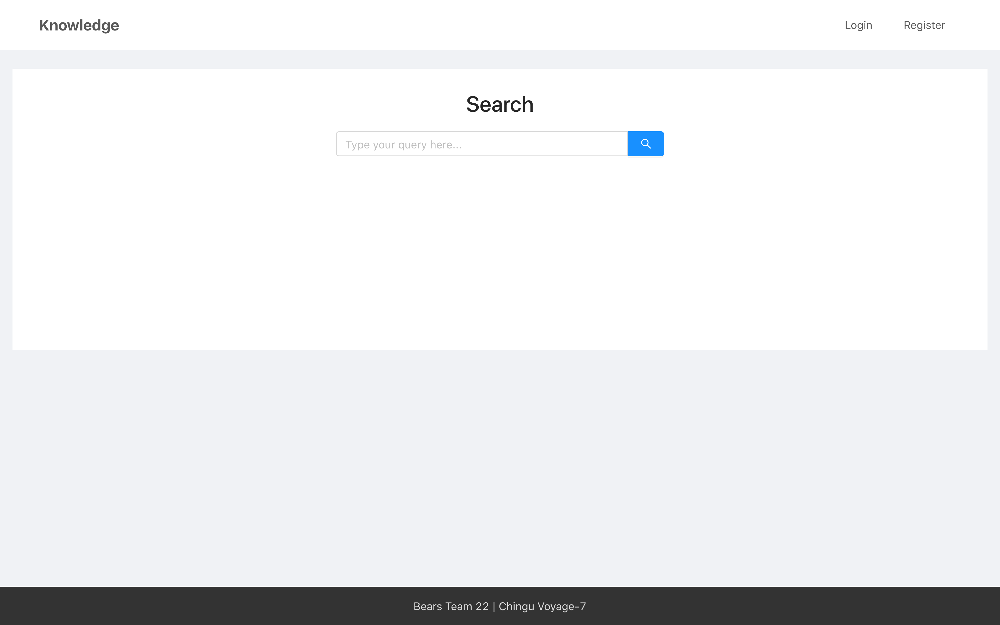

# [Knowledge](http://knowledge2019.herokuapp.com) 

> A better way to get answers to your questions

_Developed during the Chingu Voyage-7 cohort by bears team 22. Read more about Chingu [here](https://chingu.io)._

## MVP

See [the MVP spec](docs/mvp.md).

## Development

### Getting started

First of all, obtain your Firebase SDK service account credentials (more info on this can be found in [this guide](https://firebase.google.com/docs/admin/setup#add_firebase_to_your_app)). Rename `server/sample.env` to `.env` (keep it in the `server` directory), and replace the placeholders with your credentials.

Then, run `npm run dev` to start the app in development mode or `npm start` to run it in production mode. It should then be running on http://localhost:3000, with the backend API running on http://localhost:5000.

See our backend API documentation [here](https://rawcdn.githack.com/chingu-voyage7/Bears-Team-22/a666ca417134b6b29758eb851f257af446b78d61/docs/index.html).

### Technical Stack

Both our frontend and backend are written in Node.js. The tech stack consists of 3 main components:

#### Frontend

- [React.js](https://reactjs.org)
- [Ant Design](https://ant.design/) - React UI components library.
- [Next.js](https://nextjs.org) - for SSR and building/starting the app.

#### Backend

- [Express.js](https://expressjs.com) - for the main API which servers the frontend app.
- [MongoDB](https://www.mongodb.com) - for data storage.
- [Firebase Auth](https://firebase.google.com/docs/auth) - for password-based user authentication

### DevOps and deployment

- [Docker](https://www.docker.com) - for deploying our backend and frontend as containers.
- [Docker Compose](https://docs.docker.com/compose) - for locally running the backend app and Mongo.
- [Heroku](https://www.heroku.com) - for deploying the frontend.
- [AWS](https://aws.amazon.com/) - to deploy the project's backend. The main AWS services we're using are EC2, ECS, Fargate, CloudFormation and [CDK](https://github.com/awslabs/aws-cdk).
- [MongoDB Atlas](https://www.mongodb.com/cloud/atlas) - for deploying Mongo to the cloud.

We're also using [various libraries and modules](https://github.com/chingu-voyage7/Bears-Team-22/network/dependencies).

## Creators

- [Itai Steinherz](https://github.com/itaisteinherz)
- [Layer](https://github.com/R-Layer)
- [Stas Maksin](https://github.com/mastas3)
- [George Keloglou](https://github.com/geokeloglou)
- [Vincent Tang](https://github.com/vincentntang)

## License

MIT
